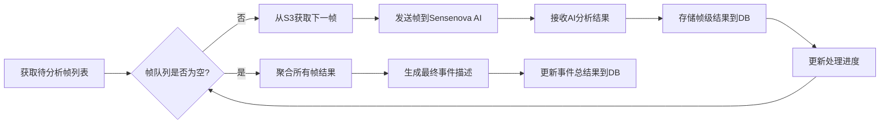

# AI Orchestration Service Flow

## Overview
The AI Orchestration Service manages the AI analysis workflow, sending frames to Sensenova and aggregating results. This service is responsible for coordinating the frame-by-frame analysis process and compiling the final event description.

## 方案说明 (Solution Description)

### 核心功能 (Core Functionality)
AI协调服务的核心功能是管理帧级AI分析工作流，将从S3存储中提取的关键帧逐一发送到Sensenova AI模型进行分析，并聚合各个帧的分析结果形成完整的事件描述。

### 技术选型 (Technology Selection)
- **AI模型集成**: 与Sensenova多模态AI模型集成，支持对单个关键帧的分析
- **云存储交互**: 与AWS S3集成，按需检索关键帧进行处理
- **数据库操作**: 与MySQL RDS集成，存储分析结果
- **容器化部署**: 服务部署在AWS EKS上，支持水平扩展

### 帧处理策略 (Frame Processing Strategy)
- **逐帧处理**: 每个关键帧独立处理，避免将所有帧同时加载到内存中
- **按需检索**: 从S3存储中按需检索帧，降低内存占用
- **顺序分析**: 按时间顺序将帧发送给AI模型分析
- **结果聚合**: 将单帧分析结果聚合成完整的事件描述

### 错误处理与重试机制 (Error Handling and Retry Mechanism)
- **失败重试**: 对分析失败的帧实施重试机制
- **死信队列**: 对持续失败的帧使用死信队列处理
- **超时管理**: 设置合理的分析超时时间
- **状态跟踪**: 跟踪每帧的处理状态

## 处理流程 (Processing Flow)

## Detailed Steps

### 1. 获取待分析帧列表
- 从数据库获取指定事件的所有待分析关键帧列表
- 初始化处理队列和状态跟踪器

### 2. 帧队列处理循环
- 检查帧队列是否为空
- 如果不为空，继续处理下一帧
- 如果为空，进入结果聚合阶段

### 3. 从S3获取下一帧
- 根据帧ID从S3存储中检索关键帧
- 验证帧数据完整性

### 4. 发送帧到Sensenova AI
- 构造AI分析请求，包含帧数据和元信息
- 调用Sensenova API进行帧分析
- 设置合理的超时时间

### 5. 接收AI分析结果
- 接收并解析AI模型返回的分析结果
- 验证结果格式和完整性

### 6. 存储帧级结果到DB
- 将单帧分析结果存储到MySQL数据库
- 更新帧处理状态和时间戳

### 7. 更新处理进度
- 更新事件整体处理进度
- 记录处理日志用于监控和调试

### 8. 聚合所有帧结果
- 收集所有已处理帧的分析结果
- 分析帧间的时间关系和事件连续性

### 9. 生成最终事件描述
- 将帧级结果聚合成连贯的事件描述
- 识别关键事件和时间点
- 生成结构化的事件报告

### 10. 更新事件总结果到DB
- 将最终事件描述存储到MySQL数据库
- 更新事件状态为完成
- 触发结果可用通知

## 数据库存储策略 (Database Storage Strategy)

### 帧级结果存储 (Frame-Level Result Storage)
存储每个帧的详细分析结果有以下优势：
1. **可追溯性**: 可以追溯每个帧的分析过程和结果
2. **调试支持**: 便于调试和分析AI模型的性能
3. **重新聚合**: 支持重新聚合结果而无需重新分析帧
4. **细粒度分析**: 支持更细粒度的后续分析

### 总结果存储 (Aggregate Result Storage)
存储聚合后的总结果有以下优势：
1. **查询性能**: 客户端查询时性能更好
2. **存储效率**: 减少存储空间占用
3. **简化接口**: 简化客户端接口设计

### 推荐方案 (Recommended Approach)
建议同时存储帧级结果和总结果：
- 帧级结果用于调试、追溯和重新聚合
- 总结果用于客户端快速查询
- 可根据存储成本考虑保留时长策略

## Technical Implementation Considerations

### 内存效率 (Memory Efficiency)
- 帧级处理避免内存过载
- 按需从S3检索帧数据
- 及时释放处理完成的帧数据

### 可扩展性 (Scalability)
- 支持多事件并行处理
- 帧级处理可分布式扩展
- 通过Kubernetes支持水平扩展

### 监控与日志 (Monitoring and Logging)
- 记录每帧处理时间和状态
- 监控AI模型响应时间和准确性
- 提供处理进度可视化
