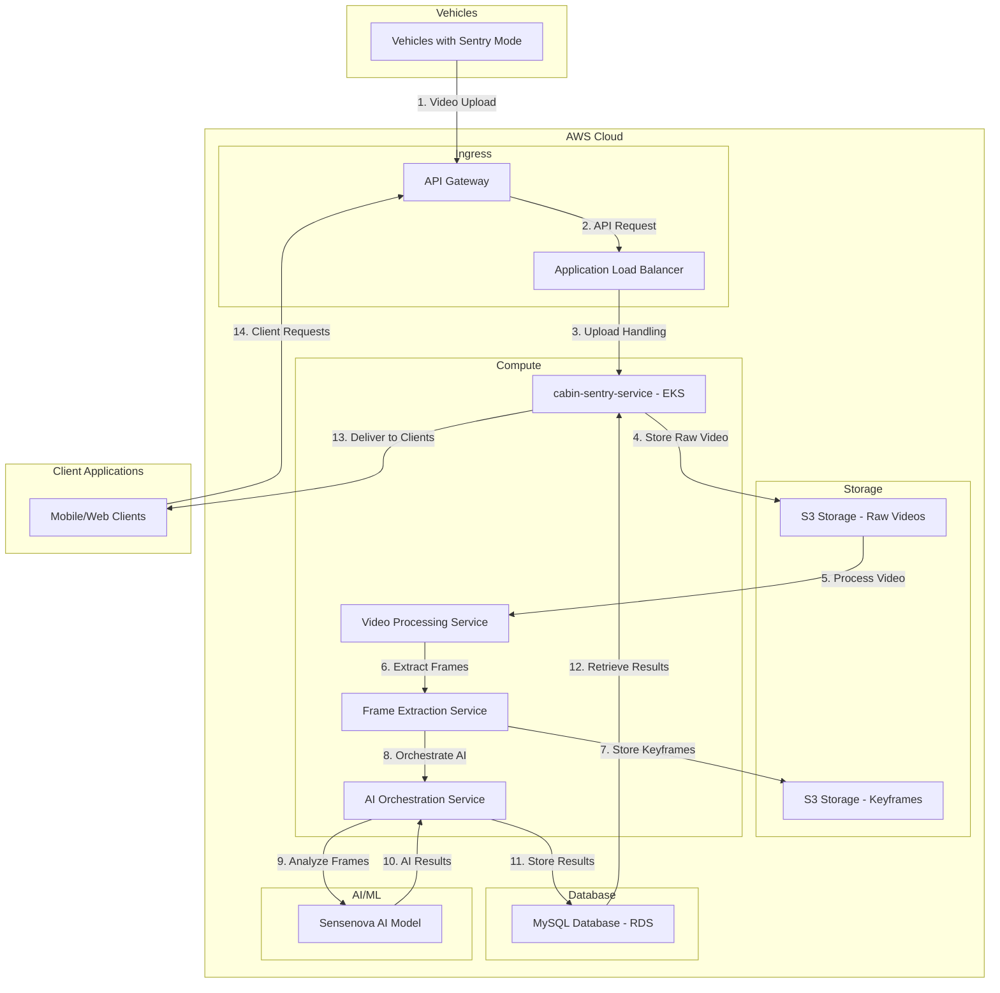

# Sentry Mode 2.0 Cloud Architecture

## Overview
This document describes the detailed architecture for the Sentry Mode 2.0 system. The architecture is designed to handle video capture from vehicles, cloud processing, AI analysis, and result delivery to end users.

## Detailed Architecture Diagram

## Component Explanations

### 1. Vehicles
- **Vehicles with Sentry Mode**: Vehicles with activated sentry mode that detect events and upload videos

### 2. AWS Cloud Infrastructure

#### Ingress Layer
- **API Gateway**: AWS API Gateway that serves as the entry point for all client requests
- **Application Load Balancer**: AWS Application Load Balancer that distributes incoming traffic

#### Storage Layer
- **S3 Storage - Raw Videos**: AWS S3 buckets for storing original video files uploaded by vehicles
- **S3 Storage - Keyframes**: AWS S3 buckets for storing extracted keyframes

#### Compute Layer
- **cabin-sentry-service - EKS**: Main Spring Boot application deployed on AWS Elastic Kubernetes Service
- **Video Processing Service**: Handles video decoding, validation, and processing
- **Frame Extraction Service**: Extracts keyframes from videos for efficient AI analysis
- **AI Orchestration Service**: Manages AI processing workflow and result aggregation

#### Database Layer
- **MySQL Database - RDS**: AWS RDS MySQL instance for storing metadata and analysis results

#### AI/ML Services
- **Sensenova AI Model**: Multimodal AI model that analyzes individual keyframes and generates descriptions

### 3. Client Applications
- **Mobile/Web Clients**: End-user applications that display alerts and analysis results

## Numbered Business Flow

1. **Video Upload**: Vehicles detect suspicious activities and upload 30-second videos to API Gateway
2. **API Request**: API Gateway routes the request through Load Balancer
3. **Upload Handling**: cabin-sentry-service receives and processes the upload
4. **Store Raw Video**: Raw videos are stored in S3 Storage for persistence
5. **Process Video**: Video Processing Service retrieves videos from S3 for processing
6. **Extract Frames**: Frame Extraction Service extracts keyframes from videos
7. **Store Keyframes**: Extracted keyframes are stored in S3 for AI processing
8. **Orchestrate AI**: AI Orchestration Service manages the AI analysis workflow
9. **Analyze Frames**: Individual keyframes are sent to Sensenova AI Model for analysis
10. **AI Results**: AI analysis results are returned to AI Orchestration Service
11. **Store Results**: Processed AI results are stored in MySQL RDS database
12. **Retrieve Results**: cabin-sentry-service retrieves results from database for client requests
13. **Deliver to Clients**: Formatted results are delivered to Mobile/Web clients
14. **Client Requests**: Clients make requests for analysis results through API Gateway

## Database Access Pattern Correction

The previous architecture incorrectly showed a direct connection from the database to clients. This has been corrected to follow proper security and architectural principles:

### Proper Database Access

1. **No Direct Client Access**: Clients cannot directly access the database for security reasons:
   - Prevents SQL injection attacks
   - Maintains data integrity through controlled access patterns
   - Allows for business logic implementation in the service layer
   - Enables caching and performance optimizations

2. **Service-Mediated Access**: All database access is mediated through cabin-sentry-service:
   - Clients make API requests to cabin-sentry-service through API Gateway
   - cabin-sentry-service retrieves data from MySQL RDS
   - cabin-sentry-service applies business logic, formatting, and security checks
   - Results are returned to clients through the established API

3. **Data Flow Direction**: The corrected data flow is:
   - AI Orchestration Service → MySQL RDS (storage)
   - MySQL RDS → cabin-sentry-service (retrieval)
   - cabin-sentry-service → Clients (delivery)

### Security and Architecture Benefits

1. **Security Layer**: cabin-sentry-service acts as a security layer:
   - Authentication and authorization checks
   - Input validation and sanitization
   - Rate limiting and abuse prevention

2. **Business Logic Centralization**: All business logic resides in the service layer:
   - Consistent data processing and formatting
   - Easy updates and modifications
   - Centralized error handling and logging

3. **Scalability**: Service layer can be scaled independently:
   - Database access can be optimized and pooled
   - Caching strategies can be implemented
   - Load balancing works at the service level

## Frame-by-Frame Processing Workflow

The AI processing workflow has been corrected to accurately represent how frame analysis works:

### Frame-by-Frame Processing

1. **Individual Frame Processing**: Each keyframe is processed individually by the AI Orchestration Service
   - Frames are retrieved from S3 storage on-demand
   - No need to keep all frames in memory simultaneously
   - Processing can be scaled across multiple workers

2. **AI Orchestration**: AI Orchestration Service (I) manages the AI workflow:
   - Retrieves keyframes from S3 storage
   - Sends frames one-by-one to Sensenova AI Model
   - Collects and aggregates results from individual frame analysis
   - Handles retries for failed frame processing
   - Manages processing queues and load distribution

3. **Result Aggregation**: AI results are aggregated by the AI Orchestration Service:
   - Individual frame descriptions are combined into a coherent event narrative
   - Temporal relationships between frames are analyzed
   - Key events and timestamps are identified
   - Summary results are stored directly in MySQL RDS

4. **Service-Mediated Result Delivery**: Results flow from database to cabin-sentry-service to clients:
   - Database stores raw analysis results
   - cabin-sentry-service retrieves and formats results for client consumption
   - Clients receive properly formatted responses through the API

### Asynchronous Processing Pattern

The architecture implements an asynchronous processing pattern where video upload and video processing are decoupled:

#### Benefits of Asynchronous Processing

1. **Immediate Response**: Vehicles receive immediate acknowledgment after uploading to S3, allowing them to quickly resume monitoring activities without waiting for processing to complete.

2. **System Decoupling**: Separating upload from processing allows each component to scale independently:
   - Upload handling can be optimized for high throughput
   - Processing can be scaled based on computational demands

3. **Fault Tolerance**: If processing services are temporarily unavailable, videos remain safely stored in S3 and can be processed when services recover.

4. **Horizontal Scalability**: Multiple Video Processing Services can work in parallel on different videos, enabling the system to handle bursts of uploads from multiple vehicles.

5. **Retry Mechanisms**: Failed processing attempts can be retried without requiring vehicles to re-upload videos.

#### Processing Workflow

1. **Upload Phase**: Vehicle → API Gateway → cabin-sentry-service → S3 (immediate)
2. **Notification Phase**: S3 event triggers notification to Video Processing Service (asynchronous)
3. **Processing Phase**: Video Processing Service retrieves and processes video (asynchronous)
4. **Analysis Phase**: Frame Extraction Service → AI Orchestration Service → Sensenova AI Model (asynchronous)
5. **Result Phase**: AI Orchestration Service stores results in database (asynchronous)
6. **Client Request Phase**: Client → API Gateway → cabin-sentry-service → MySQL RDS → cabin-sentry-service → Client

This pattern is essential for IoT scenarios where devices have intermittent connectivity and need to minimize the time spent waiting for cloud operations to complete.

## Technical Specifications

### Video Processing
- **Format**: MP4, 30 seconds long (15s before and after event)
- **Frame Rate**: 30 fps
- **Bitrate**: 5 Mbps (target) or 10 Mbps (optional)
- **File Size**: 18.75 MB to 37.5 MB

### Keyframe Extraction
- **Base Strategy**: 1 frame per second
- **Enhanced Strategy**: 1-3-5 frames per second based on detection accuracy
- **Output Format**: JPG/PNG
- **Storage**: Separate S3 bucket for keyframes
