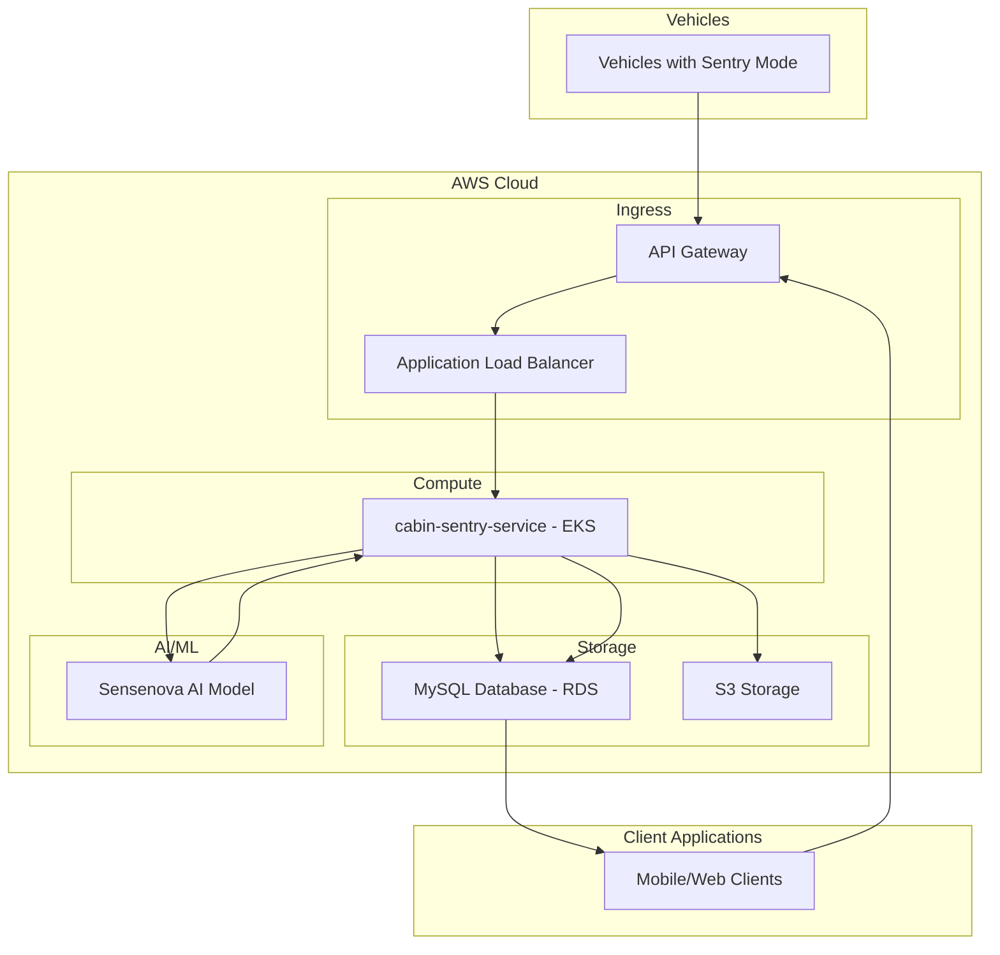

# Sentry Mode 2.0 Cloud Architecture

## Overview
This document describes the high-level architecture for the Sentry Mode 2.0 system. The architecture is designed to handle video capture from vehicles, cloud processing, AI analysis, and result delivery to end users.

## High-Level Architecture Diagram

## Component Explanations

### 1. Vehicles
- **Vehicles with Sentry Mode**: Vehicles with activated sentry mode that detect events and upload videos

### 2. AWS Cloud Infrastructure

#### Ingress Layer
- **API Gateway**: AWS API Gateway that serves as the entry point for all client requests
- **Application Load Balancer**: AWS Application Load Balancer that distributes incoming traffic

#### Compute Layer
- **cabin-sentry-service - EKS**: Main Spring Boot application deployed on AWS Elastic Kubernetes Service

#### Storage Layer
- **MySQL Database - RDS**: AWS RDS MySQL instance for storing metadata and analysis results
- **S3 Storage**: AWS S3 buckets for storing video files and keyframes

#### AI/ML Services
- **Sensenova AI Model**: Multimodal AI model that analyzes videos and generates descriptions

### 3. Client Applications
- **Mobile/Web Clients**: End-user applications that display alerts and analysis results

## Data Flow

1. Vehicles detect suspicious activities and automatically record 30-second videos
2. Videos are uploaded to the system through API Gateway and Load Balancer
3. cabin-sentry-service processes the videos:
   - Stores raw videos in S3
   - Sends videos to Sensenova AI Model for analysis
   - Stores results in MySQL RDS database
4. Mobile/Web clients retrieve analysis results through the API
