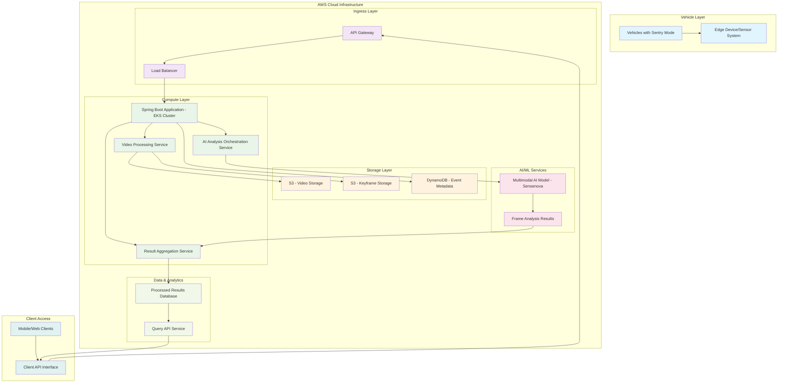

# Sentry Mode 2.0 Cloud Architecture

## High-Level Architecture Diagram

## Component Descriptions

### Vehicle Layer
- **Vehicles with Sentry Mode**: Tesla vehicles with activated sentry mode
- **Edge Device/Sensor System**: Onboard systems that detect events and capture video

### AWS Cloud Infrastructure

#### Ingress Layer
- **API Gateway**: Entry point for all client requests
- **Load Balancer**: Distributes incoming traffic across application instances

#### Compute Layer (Spring Boot on EKS)
- **Spring Boot Application**: Main application deployed on AWS EKS
- **Video Processing Service**: Handles video upload, validation, and preprocessing
- **AI Analysis Orchestration Service**: Manages the AI analysis workflow
- **Result Aggregation Service**: Combines frame-level analysis into event-level results

#### Storage Layer
- **S3 - Video Storage**: Stores original 30-second event videos
- **S3 - Keyframe Storage**: Stores extracted keyframes from videos
- **DynamoDB - Event Metadata**: Stores event metadata and processing status

#### AI/ML Services
- **Multimodal AI Model (Sensenova)**: Performs semantic analysis on videos and keyframes
- **Frame Analysis Results**: Intermediate results from AI model processing

#### Data & Analytics
- **Processed Results Database**: Stores final structured event analysis results
- **Query API Service**: Provides endpoints for clients to retrieve analysis results

### Client Access
- **Mobile/Web Clients**: End-user applications that display alerts and analysis
- **Client API Interface**: Interface for client applications to interact with the system
